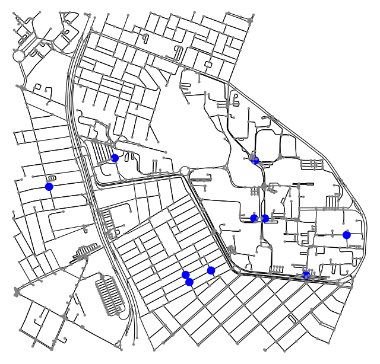

# Evaluating Mobility Near UFRN for Bike Sharing Dock Stations Placement :busts_in_silhouette:

## Objective: Analyze mobility for optimal placement of bike-sharing dock stations around UFRN

### Student: João Igor Ramos de Lima :mortar_board:

### Algorithms and Data Structure II (DCA3702)

---

## Project Description

This project aims to evaluate mobility around UFRN to determine optimal locations for installing bike-sharing dock stations. The analysis will focus on identifying key neighborhoods around the university that could benefit from such stations and assessing strategic placement options.

## Key Question
**Where are the optimal locations for dock-station placement?**

One way to answer it is to take into account the following network statistics:

### Metrics

- **Degree Centrality:** Number of connections of each neighborhood node.
- **Closeness Centrality:** Calculates the average distance from each node to all other nodes, assessing overall accessibility.
- **Betweenness Centrality:** Analyzes each neighborhood's position on the shortest paths, determining areas of intermediation.
- **Eigenvector Centrality:** Assesses each node's influence based on the importance of its neighbors.

### CDF and PDF Analysis of Node Degrees

This statistical approach will evaluate the distribution of connections, providing insights into connectivity patterns.
  
### Multivariate Centrality Analysis

A comprehensive, multivariable analysis will assess the interplay among different centrality metrics.

### Core/Shell

Who constitutes the core and shell of the network?

---

## Implementing UFRN Mobility Graph Network

To address the problem, we can start creating a network graph representing the UFRN area, including nearby neighborhoods such as Candelária, Lagoa Nova, Capim Macio, and Nova Descoberta. We can achieve this using the **OSMnx** library in Python.

```python

import osmnx as ox
import networkx as nx

ufrn_box = -5.82846, -5.84804, -35.21549, -35.19446

ufrn = ox.graph_from_bbox(bbox=ufrn_box, network_type='bike')

fig, ax = ox.plot_graph(ufrn, bgcolor='white', node_color='red', edge_color='black', node_size=10, edge_linewidth=0.8)

```


### Answering the Key Question with the Degree Centrality metric

To address this, we can utilize the **NetworkX** function **`nx.degree_centrality`**. This function will get us a dictionary data structure with all nodes and their degree centrality values. Then we can restrict it to identify and highlight the nodes with the highest values.

```python

degree_centrality = nx.degree_centrality(ufrn)

top_10_nodes = sorted(degree_centrality, key=degree_centrality.get, reverse=True)[:10]

node_colors = ['blue' if node in top_10_nodes else 'grey' for node in ufrn.nodes]
node_sizes = [100 if node in top_10_nodes else 10 for node in ufrn.nodes]

fig, ax = ox.plot_graph(
    ufrn,
    bgcolor='white',
    node_color=node_colors,
    edge_color='black',
    node_size=node_sizes,
    edge_linewidth=0.8
)

```


