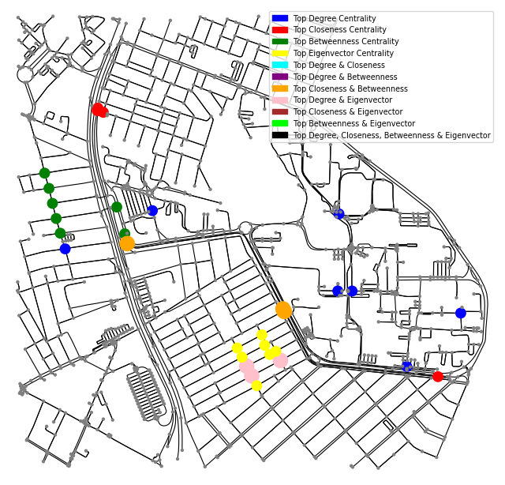
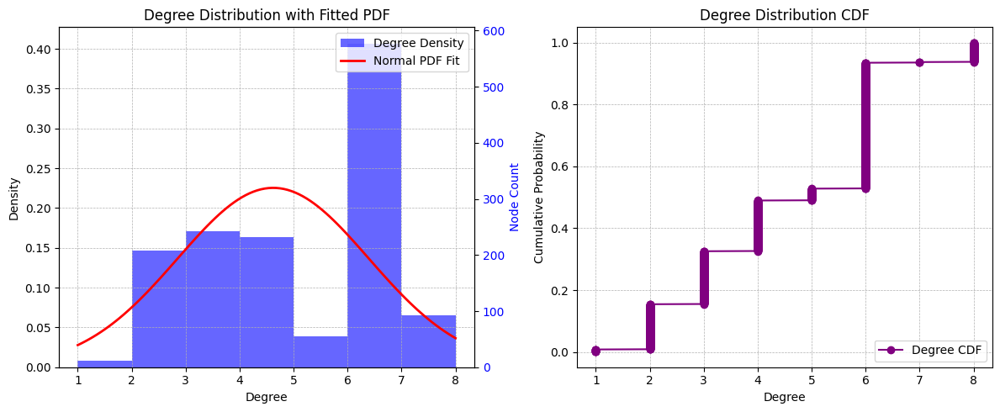

# Evaluating Mobility Near UFRN for Bike Sharing Dock Stations Placement :busts_in_silhouette:

## Objective: Analyze mobility for optimal placement of bike-sharing dock stations around UFRN

This project aims to evaluate mobility around UFRN to determine optimal locations for installing bike-sharing dock stations. The analysis will focus on identifying key neighborhoods around the university that could benefit from such stations and assessing strategic placement options.

> ## Federal University of Rio Grande do Norte  
> ## Technology Center  
> ### Department of Computer Engineering and Automation  
> #### Course: **Algorithms and Data Structure II (DCA3702)**  
> #### Author: **João Igor Ramos de Lima :mortar_board:**
>
> This repository contains solutions to the tasks and exercises assigned in the Algorithms and Data Structure II (DCA3702) course.
>
> ### Contact
> [igorservo159@gmail.com](mailto:igorservo159@gmail.com)
>
> Copyright (c) 2024, João Igor Ramos de Lima.  
> All rights reserved.   
> SPDX-License-Identifier: BSD-2-Clause

---

## Key Question
**Where are the optimal locations for dock-station placement?**

One way to answer it is to take into account the following network statistics:

### Centrality Metrics

- **Degree Centrality:** Number of connections of each neighborhood node.
- **Closeness Centrality:** Calculates the average distance from each node to all other nodes, assessing overall accessibility.
- **Betweenness Centrality:** Analyzes each neighborhood's position on the shortest paths, determining areas of intermediation.
- **Eigenvector Centrality:** Assesses each node's influence based on the importance of its neighbors.

### CDF and PDF Analysis of Node Degrees

This statistical approach will evaluate the distribution of connections, providing insights into connectivity patterns.
  
### Multivariate Centrality Analysis

A comprehensive, multivariable analysis will assess the interplay among different centrality metrics.

### Core/Shell

Who constitutes the core and shell of the network?

---

## Implementing UFRN Mobility Graph Network

To address the problem, we can start creating a network graph representing the UFRN area, including nearby neighborhoods such as Candelária, Lagoa Nova, Capim Macio, and Nova Descoberta. We can achieve this using the **OSMnx** library in Python.


```python

import osmnx as ox
import networkx as nx
import matplotlib.pyplot as plt
import matplotlib.patches as mpatches
from scipy.stats import gaussian_kde

```

```python

ufrn_box = -5.82846, -5.84804, -35.21549, -35.19446

ufrn = ox.graph_from_bbox(bbox=ufrn_box, network_type='bike')

fig, ax = ox.plot_graph(ufrn, bgcolor='white', node_color='red', edge_color='black', node_size=10, edge_linewidth=0.8)

```
> UFRN Bike Network Graph


### Answering the Key Question with Centrality Metrics

To address the question, we analyze the **top central nodes** in the network using four centrality metrics: **Degree**, **Closeness**, **Betweenness**, and **Eigenvector**. By focusing on the top nodes for each metric, we can identify key nodes and intersections between these metrics.

The steps involve calculating each centrality measure and selecting the top 10 nodes for each. Intersections between metrics highlight nodes that exhibit high centrality in multiple measures, indicating their prominent role in network connectivity.

```python

centrality_measures = {
    'degree': nx.degree_centrality(ufrn),
    'closeness': nx.closeness_centrality(ufrn),
    'betweenness': nx.betweenness_centrality(ufrn),
    'eigenvector': nx.eigenvector_centrality(ox.convert.to_digraph(ufrn), max_iter=1000)
}

top_10_nodes = {key: set(sorted(measure, key=measure.get, reverse=True)[:10]) for key, measure in centrality_measures.items()}

top_combinations = {
    'degree & closeness': top_10_nodes['degree'] & top_10_nodes['closeness'],
    'degree & betweenness': top_10_nodes['degree'] & top_10_nodes['betweenness'],
    'degree & eigenvector': top_10_nodes['degree'] & top_10_nodes['eigenvector'],
    'closeness & betweenness': top_10_nodes['closeness'] & top_10_nodes['betweenness'],
    'closeness & eigenvector': top_10_nodes['closeness'] & top_10_nodes['eigenvector'],
    'betweenness & eigenvector': top_10_nodes['betweenness'] & top_10_nodes['eigenvector'],
    'all metrics': top_10_nodes['degree'] & top_10_nodes['closeness'] & top_10_nodes['betweenness'] & top_10_nodes['eigenvector']
}

for name, nodes in {**top_10_nodes, **top_combinations}.items():
    print(f'Top 10 {name.capitalize()} Centrality: {nodes}')

color_map = {
    'all metrics': ('black', 250),
    'degree & closeness': ('cyan', 200),
    'degree & betweenness': ('purple', 200),
    'degree & eigenvector': ('pink', 200),
    'closeness & betweenness': ('orange', 200),
    'closeness & eigenvector': ('brown', 200),
    'betweenness & eigenvector': ('lime', 200),
    'degree': ('blue', 100),
    'closeness': ('red', 100),
    'betweenness': ('green', 100),
    'eigenvector': ('yellow', 100),
    'default': ('grey', 10)
}

node_colors, node_sizes = [], []

for node in ufrn.nodes:
    color, size = color_map['default']  # Valores padrão

    for label, nodes in top_combinations.items():
        if node in nodes:
            color, size = color_map[label]
            break
    else:
        for label, nodes in top_10_nodes.items():
            if node in nodes:
                color, size = color_map[label]
                break

    node_colors.append(color)
    node_sizes.append(size)

fig, ax = ox.plot_graph(
    ufrn,
    bgcolor='white',
    node_color=node_colors,
    edge_color='black',
    node_size=node_sizes,
    edge_linewidth=0.8,
    show=False,
    close=False
)

legend_handles = [mpatches.Patch(color=color, label=label.replace(' & ', ' and ').title()) for label, (color, _) in color_map.items() if label != 'default']

plt.legend(
    handles=legend_handles, 
    loc='upper right', 
    fontsize='x-small',  
    frameon=True, 
    markerscale=0.7
)
plt.show()

```

> UFRN Bike Network Graph with Centrality Metrics

<a id="centrality-metrics"></a>


### Using PDF and CDF analysis of node degrees to select optimal locations

To determine the best locations for bike stations, we can analyze **node degrees** using two statistical tools: **PDF (Probability Density Function)** and **CDF (Cumulative Distribution Function)**. This approach helps identify highly connected nodes (hubs) and prioritize station placement for optimal coverage and accessibility.

The steps involve the following:

1. **Identify High-Degree Nodes (Hubs):** The **PDF of node degrees** reveals the distribution of connectivity within the network. Nodes with higher degrees represent hubs with more connections, indicating areas with potentially higher traffic. These nodes are strong candidates for bike stations, as they can serve more students and visitors efficiently.

2. **Use the CDF to Select a Fraction of the Most Connected Nodes:** The **CDF allows for selecting specific percentiles** of nodes based on degree. For instance, choosing nodes above the 90th percentile (top 10%) ensures that bike stations are located in areas with significantly higher connectivity, maximizing their utility.

```python

degrees = [deg for _, deg in ufrn.degree()]

fig, (ax1, ax2) = plt.subplots(1, 2, figsize=(12, 5))


counts, bins, patches = ax1.hist(degrees, bins=range(min(degrees), max(degrees) + 1), 
                                 density=True, alpha=0.6, color='blue', label='Degree Density')

mean_deg = np.mean(degrees)
std_deg = np.std(degrees)
x = np.linspace(min(bins), max(bins), 100)
p = norm.pdf(x, mean_deg, std_deg)
ax1.plot(x, p, 'r', linewidth=2, label='Normal PDF Fit')

ax1_twin = ax1.twinx()
counts, bins, _ = ax1_twin.hist(degrees, bins=range(min(degrees), max(degrees) + 1), 
                                alpha=0, color='blue')  
ax1_twin.set_ylabel('Node Count', color='blue')
ax1_twin.tick_params(axis='y', labelcolor='blue')
ax1_twin.set_ylim(0, max(counts) * 1.1) 

ax1.set_title('Degree Distribution with Fitted PDF')
ax1.set_xlabel('Degree')
ax1.set_ylabel('Density')
ax1.legend(loc='upper right')
ax1.grid(True, which='both', linestyle='--', linewidth=0.5)


sorted_degrees = np.sort(degrees)
cdf = np.arange(1, len(sorted_degrees) + 1) / len(sorted_degrees)

ax2.plot(sorted_degrees, cdf, marker='o', linestyle='-', color='purple', label='Degree CDF')
ax2.set_title('Degree Distribution CDF')
ax2.set_xlabel('Degree')
ax2.set_ylabel('Cumulative Probability')
ax2.grid(True, which='both', linestyle='--', linewidth=0.5)
ax2.legend(loc='lower right')

plt.tight_layout()
plt.show()

```

> PDF Degree Distribution



> CDF Degree Distribution


The information obtained above from the PDF and CDF graphs helps us understand that the nodes highlighted in blue (degree centrality) in the [image](./centrality_metrics.png) represent the top 10% most connected nodes in the university network map. These nodes serve as excellent candidates for potential locations for bike docking stations, as their high connectivity indicates areas with significant accessibility and movement, making them ideal for meeting user demand efficiently.
