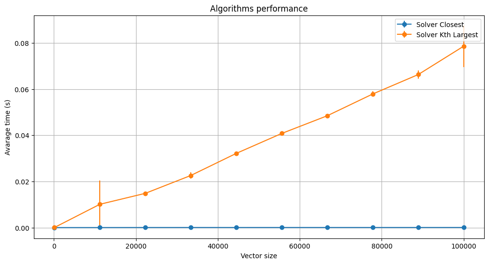

# BST Problem Performance Assessment :busts_in_silhouette:

## Objective: Evaluate the performance of two algorithms of binary search tree closestvalue.py and largestvalue.py considering several random and reproducible inputs, varying the size of the input vector up to a large value N.

The analysis involves instrumenting the code with the time module, ensuring reproducible results by setting a random seed, and performing multiple executions for each vector size to compute average execution times and confidence intervals. Results will be visualized through graphic correlating vector size with average execution time, including error bars to represent confidence intervals. 

> ## Federal University of Rio Grande do Norte  
> ## Technology Center  
> ### Department of Computer Engineering and Automation  
> #### Course: **Algorithms and Data Structure II (DCA3702)**  
> #### Author: **João Igor Ramos de Lima :mortar_board:**
>
> This repository contains solutions to the tasks and exercises assigned in the Algorithms and Data Structure II (DCA3702) course.
>
> ### Contact
> [igorservo159@gmail.com](mailto:igorservo159@gmail.com)
>
> This project is licensed under the [MIT License](../../LICENSE)  
> © 2024 João Igor Ramos de Lima.  
> SPDX-License-Identifier: MIT

### [Video explaining the activity](https://www.loom.com)

---

## Binary Search Tree (BST) Classes

In [Jupyter Notebook](./BST_problems_performance.ipynb) there is a code with some useful classes for creating and managing a Binary Search Tree (BST). The code defines two main classes: `Node`, which represents the individual nodes of the tree, and `BST`, which handles the overall tree structure. It includes methods for adding elements, checking if a value exists, and visualizing the tree using Plotly. This implementation is designed for efficiency and supports recursive operations for tree traversal and management. 

*The **`%%file`** magic command in Jupyter is used to save the implementation in a separate Python file.* In this case the code is saved at `binarysearchtree.py`.

## Closest Value

The next code at the notebook provides a function to find the value in a Binary Search Tree (BST) that is closest to a given **target** value. The implementation consists of a helper function, findClosestValueInBstHelper, which recursively explores the tree nodes and updates the closest value based on the absolute difference between the target and the current node's value. 

The main function, findClosestValue, acts as an entry point, starting the search from the root of the tree. The use of recursion ensures an efficient traversal of the BST. 

This code section is saved at `closestvalue.py`.

## Largest Value

The next part defines a function to find the **k** *kth largest* value in a Binary Search Tree (BST). The implementation relies on an auxiliary function, `inOrderTraverse`, which performs an in-order traversal of the tree to generate a sorted list of node values. 

The main function, `findKthLargestValue`, computes the result by accessing the appropriate index from this sorted list. The approach ensures that the values are processed in ascending order, making it easy to identify the desired kth largest element. 

This code section is saved at `largestvalue.py`.

## Algorithm Performance Testing

The code evaluates the **performance** of the algorithms `findClosestValue`, which identifies the closest value to a target in a Binary Search Tree (BST), and `findKthLargestValue`, which retrieves the kth largest value from the same tree. The analysis is conducted across a range of input sizes to examine how the algorithms scale with increasing data.

To accurately estimate the average execution time for each algorithm, multiple runs (`executions_per_size`) are performed for each input size. Averaging these runs minimizes the impact of random **fluctuations**, such as those caused by system noise or temporary resource constraints.

The **confidence intervals** are calculated to quantify the reliability of the measured execution times. These intervals represent the range within which the true average execution time lies with 95% confidence. They are computed using the standard deviation of the times and the Student's t-distribution, with smaller intervals indicating higher measurement reliability.

The size of the input vector (`vector_sizes`) is varied to evaluate the impact of input size on execution time. This variation helps in understanding the time **complexity** of the algorithms, offering insights into their efficiency across different data scales.

```python
from binarysearchtree import *
from largestvalue import findKthLargestValue
from closestvalue import findClosestValue

# Configs
np.random.seed(42)
N = 100000
steps = 10
executions_per_size = 10

vector_sizes = np.linspace(100, N, steps, dtype=int)

# Vectors to data collection
results_closest = []
results_kth_largest = []
confidence_intervals_closest = []
confidence_intervals_kth_largest = []

# Test the algorithms
for size in vector_sizes:
    times_closest = []
    times_kth_largest = []

    # Create test datatest
    target = size/2
    data = np.random.randint(0, size, size)

    bst = BST()
    for value in data:
        bst.add(value)

    for _ in range(executions_per_size):
        # Measure time for solver_closest
        start = time()
        findClosestValue(bst, target)
        times_closest.append(time() - start)

        # Measure time for solver_kth_largest
        start = time()
        findKthLargestValue(bst, k=5)
        times_kth_largest.append(time() - start)

    # Calculate the avarage time and confidence interval (95%)
    mean_closest = np.mean(times_closest)
    mean_kth_largest = np.mean(times_kth_largest)

    std_closest = np.std(times_closest, ddof=1)
    std_kth_largest = np.std(times_kth_largest, ddof=1)

    ci_closest = t.ppf(0.975, executions_per_size-1) * (std_closest / np.sqrt(executions_per_size))
    ci_kth_largest = t.ppf(0.975, executions_per_size-1) * (std_kth_largest / np.sqrt(executions_per_size))

    results_closest.append(mean_closest)
    results_kth_largest.append(mean_kth_largest)

    confidence_intervals_closest.append(ci_closest)
    confidence_intervals_kth_largest.append(ci_kth_largest)
```

### Visualization

The results are plotted using error bars to visualize the average execution times alongside their confidence intervals. This allows for a clear comparison of the algorithms' performance and their variability across different input sizes. 

By combining repeated runs, confidence intervals, and varying input sizes, this approach provides a robust evaluation of algorithm efficiency and scalability.



> Performance Graphic

#### Observations

*  **Solver Closest**  
   The execution time of `Solver Closest` remains constant as the input size increases. This behavior suggests that the algorithm operates in **O(1)** time complexity .

*  **Solver Kth Largest**  
   In contrast, the execution time of `Solver Kth Largest` grows linearly with the input size even with some unexpected values of time which escape the linear behavior due fluctuations. This trend indicates that its time complexity is **O(N)**, likely because the implementation involves traversing the entire BST to identify the kth largest element.
