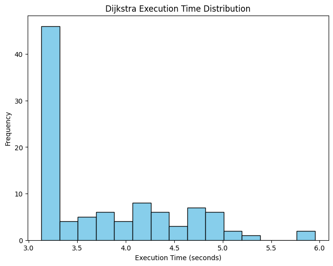
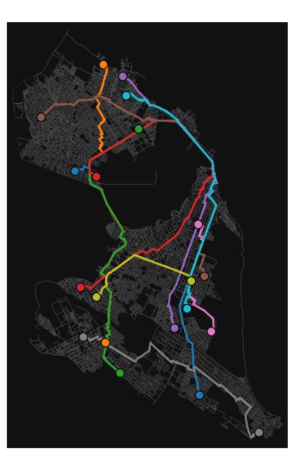

# Analysis of Dijkstra and Kruskal Algorithms :busts_in_silhouette:

## Objective: Analyze the implementation and performance of Dijkstra and Kruskal algorithms for finding shortest paths and designing optimal infrastructure layouts in Natal-RN, Brazil.

The analysis of the Dijkstra algorithm involves comparing the NetworkX implementation with a custom Dijkstra implementation using a min-heap. This comparison will identify the shortest paths between ten pairs of origin-destination nodes in the Natal-RN city graph, ensuring each pair is separated by a minimum distance of 5 km. For the Kruskal algorithm, it will be utilized to construct a Minimum Spanning Tree (MST) among the city's tourist attractions, which will serve as a basis for optimizing transportation routes, improving accessibility, and designing efficient guided tour itineraries that minimize travel costs and time between key locations.

> ## Federal University of Rio Grande do Norte  
> ## Technology Center  
> ### Department of Computer Engineering and Automation  
> #### Course: **Algorithms and Data Structure II (DCA3702)**  
> #### Author: **João Igor Ramos de Lima :mortar_board:**
>
> This repository contains solutions to the tasks and exercises assigned in the Algorithms and Data Structure II (DCA3702) course.
>
> ### Contact
> [igorservo159@gmail.com](mailto:igorservo159@gmail.com)
>
> This project is licensed under the [MIT License](../../LICENSE)  
> © 2024 João Igor Ramos de Lima.  
> SPDX-License-Identifier: MIT

### [Video explaining Dijkstra](https://www.loom.com/share/be3f7365118748e4aae28c52f6a1b9f0?sid=4b3871a9-102b-4997-a0c5-5b97fbc63a55)
### [Video explaining Kruskal](https://www.loom.com/share/9283aa2734254afb884cd58a88dbd0ab?sid=6ee2dadb-53b6-4dcb-91db-b0db519fe922)

---

## Dijkstra Algorithm Performance Analysis

In the [Dijkstra Jupyter Notebook](./dijkstra.ipynb), we started by selecting 10 random origin-destination node pairs within the city of Natal-RN, ensuring a minimum distance of 5 km between them. We then computed the shortest paths for these pairs using NetworkX's Dijkstra algorithm. To obtain reliable results, the process was repeated 100 times, resulting in:

- **Mean execution time:** **1.7590 seconds**
- **Standard deviation:** **0.3743 seconds**

The graph below illustrates this performance:

> **NetworkX Execution Time Distribution**

Here are the computed paths for the 10 node pairs:

> **NetworkX Shortest Path Solution**

---

### Custom Dijkstra Implementation with Min Heap

Next, we implemented a custom version of the Dijkstra algorithm using a min-heap, along with the necessary functions for the algorithm itself and path reconstruction. Using this implementation, we computed the shortest paths for the same 10 node pairs.

Similar to the previous approach, we repeated the execution 100 times to ensure reliability. The results were as follows:

- **Mean execution time:** **3.7937 seconds**
- **Standard deviation:** **0.7131 seconds**

The graph below illustrates this performance:

> **Dijkstra Execution Time Distribution**

Here are the computed paths for the 10 node pairs:

> **Dijkstra Shortest Path Solution**

Although the custom implementation using a min-heap was expected to outperform NetworkX's Dijkstra algorithm due to its theoretically lower complexity, the observed results show a higher average execution time. This discrepancy can be attributed to several factors: the NetworkX implementation likely benefits from internal optimizations written in low-level languages such as C or Cython, whereas the custom implementation, written in Python, incurs additional overhead. Additionally, the smaller size of the graph used in this analysis may reduce the impact of the theoretical advantages of the min-heap structure, making the implementation overhead more pronounced. Further optimizations or testing on larger and more complex graphs could provide a better understanding of the performance gap.

## Using Kruskal to calculate MST of tourist points of interests of Natal city

Firstly, we get Natal multigraph and tourist points of interests (POIs) using `osmnx` and then we generate a complete graph with smallest routes between POIs using NetworkX `shortest_path` dijkstra function with road length as the weight. Next, Kruskal's algorithm is utilized on this complete graph to determine the Minimum Spanning Tree (MST). The MST links all the POIs while minimizing the total road distance, offering an optimized route for visiting all attractions efficiently. The resulting visualization is shown below:

> **Minimum Spanning Tree Graph**

- The base graph represents the entire road network of the city, with gray lines depicting individual roads.
- Key tourist attractions are marked as **Points of Interest (POIs)**, linked to the nearest nodes in the road network:
   - **Arena das Dunas** (orange),
   - **Parque das Dunas** (lime),
   - **Forte dos Reis Magos** (green),
   - **Parque da Cidade** (yellow),
   - **Museu Câmara Cascudo** (cyan),
   - **Morro do Careca** (blue).

- The **red edges** on the graph indicate the shortest paths between POIs that form part of the MST. The calculation of these paths was based on road lengths as weights.

- Considering the tourist dynamics in Natal, the route likely begins in **Ponta Negra**, home to the **Morro do Careca**. This area is a common starting point for visitors, given its popularity and proximity to various accommodations.

This visualization highlights the connectivity of Natal’s tourist attractions, aiding in the optimization of routes for tourism or logistical purposes. The total length of the computed minimum spanning tree is **21970**.

