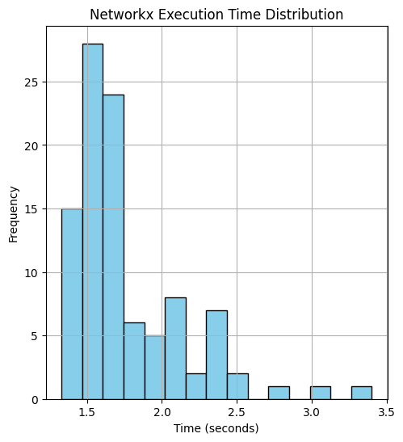

# Evaluating Dijkstra and Kruskal Algorithms :busts_in_silhouette:

## Objective: Study the implementation and performance of Dijkstra and Kruskal algorithms to find shortest paths and optimal infrastructure layouts of Natal-RN in Brazil.

The analysis of Dijkstra algorithm will compare Networkx and Dijkstra with min heap implementations to find the shortest paths between ten pair of origin-destination nodes in Natal-RN city graph separed by a minimum distance of 5 km. 

> ## Federal University of Rio Grande do Norte  
> ## Technology Center  
> ### Department of Computer Engineering and Automation  
> #### Course: **Algorithms and Data Structure II (DCA3702)**  
> #### Author: **João Igor Ramos de Lima :mortar_board:**
>
> This repository contains solutions to the tasks and exercises assigned in the Algorithms and Data Structure II (DCA3702) course.
>
> ### Contact
> [igorservo159@gmail.com](mailto:igorservo159@gmail.com)
>
> This project is licensed under the [MIT License](../../LICENSE)  
> © 2024 João Igor Ramos de Lima.  
> SPDX-License-Identifier: MIT

### [Video explaining the activity](https://www.loom.com)

---

## Dijkstra Algorithm Performance Analysis

In the [Dijkstra Jupyter Notebook](./dijkstra.ipynb), we started by selecting 10 random origin-destination node pairs within the city of Natal-RN, ensuring a minimum distance of 5 km between them. We then computed the shortest paths for these pairs using NetworkX's Dijkstra algorithm. To obtain reliable results, the process was repeated 100 times, resulting in:

- **Mean execution time:** **1.7590 seconds**
- **Standard deviation:** **0.3743 seconds**

The graph below illustrates this performance:

> **NetworkX Execution Time Distribution**

Here are the computed paths for the 10 node pairs:

> **NetworkX Shortest Path Solution**

---

### Custom Dijkstra Implementation with Min Heap

Next, we implemented a custom version of the Dijkstra algorithm using a min-heap, along with the necessary functions for the algorithm itself and path reconstruction. Using this implementation, we computed the shortest paths for the same 10 node pairs.

Similar to the previous approach, we repeated the execution 100 times to ensure reliability. The results were as follows:

- **Mean execution time:** **3.7937 seconds**
- **Standard deviation:** **0.7131 seconds**

The graph below illustrates this performance:

> **Dijkstra Execution Time Distribution**

Here are the computed paths for the 10 node pairs:

> **Dijkstra Shortest Path Solution**

Although the custom implementation using a min-heap was expected to outperform NetworkX's Dijkstra algorithm due to its theoretically lower complexity, the observed results show a higher average execution time. This discrepancy can be attributed to several factors: the NetworkX implementation likely benefits from internal optimizations written in low-level languages such as C or Cython, whereas the custom implementation, written in Python, incurs additional overhead. Additionally, the smaller size of the graph used in this analysis may reduce the impact of the theoretical advantages of the min-heap structure, making the implementation overhead more pronounced. Further optimizations or testing on larger and more complex graphs could provide a better understanding of the performance gap.
