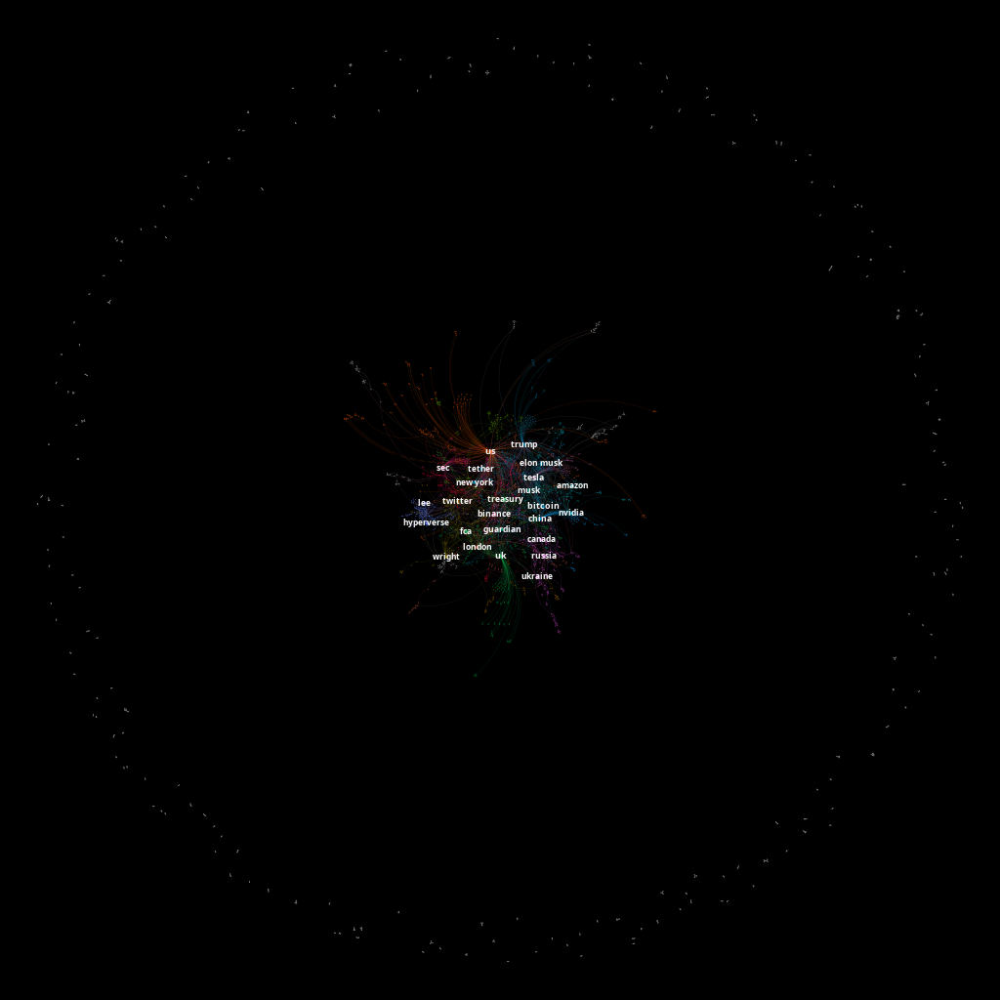
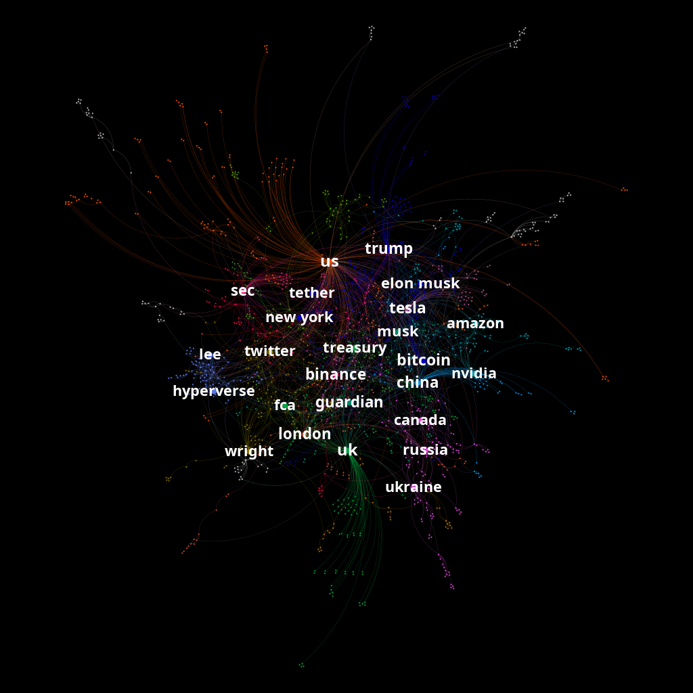
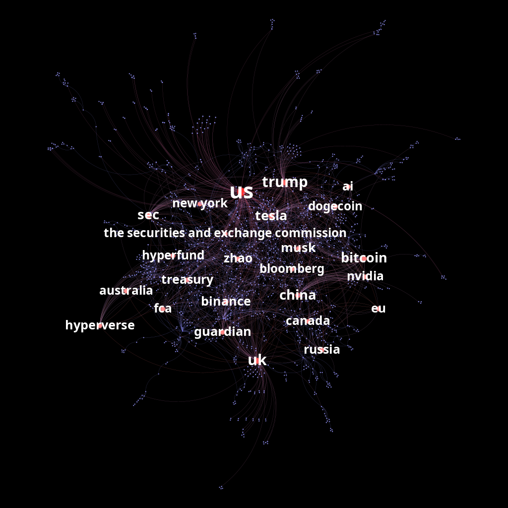
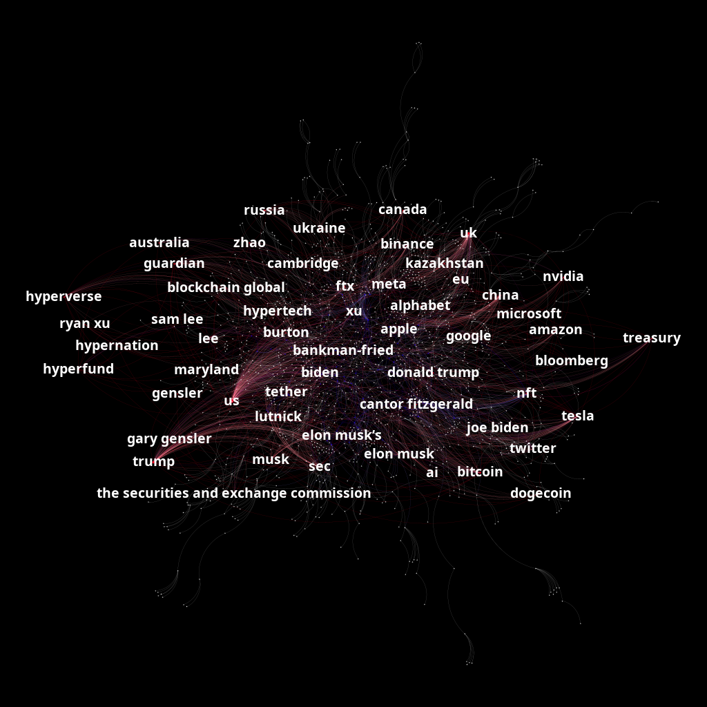

# Visualizing Bitcoin's Global Narrative :busts_in_silhouette:

## An Interactive Graph Network Using NLP

The world of cryptocurrency, led by Bitcoin, is ever-evolving, with news and updates shaping its narrative daily. To better understand the intricate web of discussions surrounding Bitcoin, I embarked on a project that combines the power of Natural Language Processing (NLP) and graph visualization. Here is a detailed look at how I used The Guardian API, *spaCy* NLP tools, the *NetworkX* Python library, and *Gephi's Sigma Explorer* plugin to create an interactive graph network from Bitcoin-related articles.

> ## Federal University of Rio Grande do Norte  
> ## Technology Center  
> ### Department of Computer Engineering and Automation  
> #### Course: **Algorithms and Data Structure II (DCA3702)**  
> #### Author: **João Igor Ramos de Lima :mortar_board:**
>
> This repository contains solutions to the tasks and exercises assigned in the Algorithms and Data Structure II (DCA3702) course.
>
> ### Contact
> [igorservo159@gmail.com](mailto:igorservo159@gmail.com)
>
> This project is licensed under the [MIT License](../../LICENSE)  
> © 2024 João Igor Ramos de Lima.  
> SPDX-License-Identifier: MIT

### [Medium Article of the Project](https://medium.com/@igorservo159/visualizing-bitcoins-global-narrative-de841f91838e)
### [Podcast](https://open.spotify.com/episode/4aWyBj7FSLHn68i6fayuxg?si=MttEeWGOS-CgGVpM5LKzoQ&nd=1&dlsi=c14244af9f334402)

---


> Generated with DALL-E

## 🌍 Practical Applications

The potential applications of this project are vast and varied, including:
- **Financial Institutions**: Providing insights for banks and investment firms to track trends and narratives impacting the cryptocurrency market.
- **Regulators and Governments**: Helping government bodies monitor and respond to shifts in public perception of Bitcoin and related regulations.
- **Academic Community**: Acting as a starting point for in-depth studies in economics, political science, and technology, offering an interactive lens into Bitcoin’s evolving narrative.

## 📖 Project Overview

The goal of this project was to explore the complex relationships and trends within the Bitcoin ecosystem as reflected in the news. By extracting and analyzing data from articles published by The Guardian, I aimed to identify key entities, topics, and their connections, creating a dynamic and interactive graph visualization available [here](https://igorservo159.github.io/Bitcoin_News_Articles_Network/).

To achieve this, I utilized several specialized Python libraries to streamline processing and visualization tasks:
- **scikit-network**: Provided powerful tools for graph-based data analysis and visualization.
- **python-dotenv**: Ensured secure handling of sensitive API keys.
- **spaCy**: Facilitated natural language processing tasks such as tokenization, tagging, and entity recognition.
- **NetworkX** and **Gephi**: Managed graph structures and visualization.

## 💻 Data Source: The Guardian API

The Guardian API was chosen for its high-quality, reliable journalism. It provides an efficient way to search for articles by keywords, filter by publication dates, and retrieve metadata such as titles, publication dates, and content summaries. With an API key, users can customize their queries to focus on specific sections, tags, or other criteria. In this project, parameters such as:

- **q**: Keyword query (e.g., “Bitcoin”)
- **section**: To filter by categories like “economy.”
- **tag**: For more specific topics (e.g., “technology/bitcoin”)
- **order-by**: To sort articles by publication date

helped ensure relevant and timely results.

**Example query URL:** 

```python
https://content.guardianapis.com/search?tag=technology%2Fbitcoin&order-by=newest&page-size=200&q=bitcoin&api-key=test
```

### 🔬 Fetching Bitcoin Articles

Below is the function I used to fetch Bitcoin-related articles from The Guardian API:

```python
def get_latest_guardian_articles_urls(query, api_key="test", page_size=10, tag=None, section=None):
    """
    Fetch the latest article URLs related to a specific query from The Guardian API..
    """
    base_url = "https://content.guardianapis.com/search"
    params = {}
    if section:
        params["section"] = section
    if tag:
        params["tag"] = tag
    params["order-by"] = "newest"
    params["page-size"] = page_size
    params["q"] = query
    params["api-key"] = api_key
    try:
        response = requests.get(base_url, params=params)
        response.raise_for_status()
        print(f"Request URL: {response.url}")
        articles_data = response.json()
        if articles_data and articles_data['response']['results']:
            return [article["webUrl"] for article in articles_data['response']['results']]
        print("No articles found.")
        return []
    except requests.exceptions.RequestException as e:
        print(f"Error fetching articles: {e}")
        return None
```

To compare trends over time, I also created a function that fetches articles from specific years using additional parameters like from-date and to-date.

## 🧬 Processing Data with NLP

The first step involved extracting the main text content from the articles. Using **BeautifulSoup**, I parsed the HTML content of each URL to extract meaningful text enclosed in `<article>`, `<p>`, and header tags (`<h1>`–`<h6>`). This ensured only relevant content was processed.

```python
def get_article_text(url):
    """
    Fetches and extracts the article text from a given URL.
    """
    try:
        response = requests.get(url)
        response.raise_for_status()

        soup = BeautifulSoup(response.text, 'html.parser')
        article = soup.find('article')
        if not article:
            print(f"No <article> tag found for URL: {url}")
            return None
        tags = article.find_all(['p', 'h1', 'h2', 'h3', 'h4', 'h5', 'h6'])
        text = ''.join(tag.get_text(strip=True).rstrip('.\n') + ".\n" for tag in tags)
        return text
    except requests.exceptions.RequestException as e:
        print(f"Error processing URL {url}: {e}")
        return None
```

### 🔍 Named Entity Recognition (NER) and Proper Noun Extraction

With the article text extracted, **spaCy** was used to tokenize, extract named entities (e.g., PERSON, ORG, GPE), and identify proper nouns (NNP). The following function demonstrates this process:

```python
def process_text_with_spacy(text):
    """
    Processes text using spaCy for tokenization, POS tagging, and NER.
    """
    doc = nlp(text)
    sentences = list(doc.sents)
    entities = []
    nnp_tags = []
    
    for sentence in sentences:
        for token in sentence:
            if token.tag_ == 'NNP' and token.text.isalpha():
                nnp_tags.append(token.text)
        sentence_entities = []
        sent_doc = nlp(sentence.text)
        for ent in sent_doc.ents:
            if ent.label_ in ['PERSON', 'ORG', 'GPE']:
                entity = ent.text.strip().lower()
                if "'s" in entity:
                    entity = entity.split("'s")[0]
                if entity:
                    sentence_entities.append(entity)
        sentence_entities = list(set(sentence_entities))
        if len(sentence_entities) > 1:
            entities.append(sentence_entities)
    return nnp_tags, entities
```

**Standardizing Entities**

The line of code below ensures consistency when processing text data. By stripping leading/trailing spaces and converting text to lowercase, entities like “Bitcoin” and “bitcoin” are treated as identical:

```python
entity = ent.text.strip().lower()
```

This step prevents duplication and ensures accurate graph representation.

### 🔗 Extracting Entities from Articles

To analyze the connections between entities in the context of Bitcoin, we used a process involving natural language processing (NLP) to extract named entities from article texts. This process is implemented in the `extract_entities` function, which performs the following steps:

1. Retrieves the full text from the URLs of articles.
2. Applies the spaCy library to process the text and identify named entities.
3. Filters entities to include only those of interest, such as people (PERSON), organizations (ORG), and geopolitical entities (GPE).

```python
def extract_entities(articles_urls, print_all=False):
    """
    Extracts named entities related to theme from a list of article URLs.

    Parameters:
        articles_urls (list of str): List of URLs to process.
        print_all (bool): If True, prints URLs, entities and NNP Tags.

    Returns:
        list: A list of named entities extracted from the articles.
    """
    entities = []

    for url in articles_urls:
        text = get_article_text(url)

        if print_all:
            print(f"URL: {url}")

        if text:
            #nnp_tags, article_entities = process_text_with_nltk_and_spacy(text)
            nnp_tags, article_entities = process_text_with_spacy(text)
            entities.extend(article_entities)

            if print_all:
                print("NNP Tags (Proper Nouns):", nnp_tags)
                print(f"Filtered Named Entities (PERSON, ORG, GPE): {article_entities}\n")

    return entities
```

This approach ensures we capture meaningful relationships relevant to the topic.

### 🛠️ Constructing Network Data

After extracting entities, we use the `get_network_data` function to map their relationships. Each entity is treated as a node, and connections between entities in the same article are represented as edges in the graph. The output is a pandas DataFrame with two columns:

- `source`: The originating entity.
- `target`: The associated entity.

```python
def get_network_data(entities):

    final_sources = []
    final_targets = []

    for row in entities:

        source = row[0]
        targets = row[1:]

        for target in targets:

            final_sources.append(source)
            final_targets.append(target)

    df = pd.DataFrame({'source':final_sources, 'target':final_targets})

    return df
```

This DataFrame serves as the basis for graph construction using NetworkX.

## 🌐 Using Network Data for Graph Construction

To understand the evolution and structure of Bitcoin-related networks, we analyzed three datasets:

1. **200 Most Recent Articles**: Retrieved from The Guardian API, reflecting current trends and providing a broader view of recent developments.
2. **Relevant Articles from 2018**: Filtered by publication year to study historical patterns.

### ✉️  Exporting Graphs for Gephi Analysis

To facilitate advanced analysis, the `analyze_and_export_graph` function prepares the graphs for export to Gephi. This process includes:

- **Centrality Measures**
- **k-Core and k-Shell Decomposition**

You can see it looking at the [Jupyter Notebook](./Bitcoin_News_Analysis_NLP.ipynb).

## 📈 Results and Insights

### 🔍 Analysis of the Latest Bitcoin Articles Network

**Degree Centrality Graph**

The networks visualizations bellow represents the results of an NLP analysis on the most recent 200 articles from The Guardian focused on Bitcoin. It displays, in the first image, all components and, in the next one, the largest giant component, isolating the main cluster of interconnected terms while excluding smaller disconnected components. The 25 labeled nodes are those with the highest degree centrality, highlighting the most influential terms in the discourse around Bitcoin. Node sizes are proportional to their degree centrality, emphasizing their importance in the network, while colors represent distinct communities, revealing thematic groupings such as finance, technology, and geopolitics.



> All components degree centrality graph of last 200 articles



> Main component degree centrality graph of last 200 articles

Key terms like “Bitcoin,” “Elon Musk,” and “China” emerge as central hubs, indicating their strong relevance within this filtered analysis of Bitcoin-related content.

These central hubs suggest that the discussion around Bitcoin is deeply intertwined with influential figures, major companies, and global events. For instance, “Elon Musk” likely reflects the impact of his public statements and actions on cryptocurrency markets, while terms like “China” and “Russia” may point to geopolitical factors such as regulatory actions or mining operations.

The clustering of nodes into distinct communities provides insight into how specific topics are interlinked — for example, one community might focus on financial regulations (e.g., “SEC” or “Treasury”), while another could center on technological advancements or key players in the crypto space. This highlights the multifaceted nature of the Bitcoin narrative, where economic, social, and political dimensions are closely interconnected.

**Hubs Graph**

The hubs graph bellow highlights terms ranked by hub scores, where red nodes represents the terms with highest hubs coefficient and the size of a node is also related to nodes authority.



> Main component hubs graph network

Hubs measure their role as sources of connections to authoritative nodes. Prominent terms like “US”, “UK”, “Trump”, “SEC”, “China”, and “Bitcoin” reflect again geopolitical and economic entities central to discussions about cryptocurrency regulations and global market impacts. Similarly, “Tesla”, “Musk”, “Binance”, and “Hyperverse” showcase influential companies and figures driving crypto innovation or adoption. Other terms such as “AI,” “Nvidia,” and “Dogecoin” suggest a connection to emerging technologies and trends within the crypto ecosystem. The inclusion of entities like “The Securities and Exchange Commission” (SEC) and “Treasury” underscores the regulatory frameworks shaping the discourse.

Compared to the degree centrality graph, there are significant overlaps in key terms, such as “Bitcoin”, “Elon Musk”, “China”, and “Russia”, which appear prominently in both analyses, emphasizing their dual roles as central players and influential hubs in the network. However, terms like “Guardian”, “Binance”, and “Hyperverse” gain distinct attention in the hubs graph, highlighting their contributions as sources of influential connections. This comparison illustrates the nuanced perspectives provided by different graph metrics, with degree centrality capturing broad influence and hubs focusing on connectivity to authorities within the Bitcoin narrative.

**K-core Graph**

This visualization highlights key structures within the network: nodes in red belong to the k-core (the densely connected core of the network), while nodes in blue are part of the k-shell, which includes more peripheral connections. Only terms within the k-core are labeled.



> Main component k-core graph network

The k-core nodes represent the most influential and interconnected terms in the context of Bitcoin, reflecting central themes such as technology (e.g., “blockchain”, “AI”), companies (e.g., “Binance”, “Meta”), and key figures or entities (e.g., “Elon Musk”, “Joe Biden”). These terms are critical for understanding the central discourse around Bitcoin and its associated ecosystem.

Meanwhile, the k-shell nodes offer insights into broader or less central topics that still maintain some connection to the core discussions. The k-shell provides a framework to analyze the diffusion of information or the reach of topics from the core to more peripheral areas.

This graph reveals the multidisciplinary nature of Bitcoin discourse, linking it to technology, finance, politics, and regulation. It also emphasizes the interconnectedness of major players and themes, such as cryptocurrencies’ impact on global economies and the regulatory challenges they pose. The network structure highlights the dominant narratives and the interplay between innovation, politics, and corporate influence.

### 🕰️ Deep Dive into the Bitcoin Network of 2018

The network visualization bellow for Bitcoin-related articles from 2018 showcases the giant component, focusing on the main cluster of interconnected terms. The 25 nodes with the highest degree centrality are highlighted, representing the most influential terms in the discourse at the time. Node sizes are proportional to their degree centrality, while distinct colors indicate thematic communities, revealing different facets of the Bitcoin narrative.


> Main component degree centrality graph of articles from 2018

In 2018, terms like “Bitcoin”, “blockchain”, and “China” emerge as prominent hubs, indicating their strong relevance to the discussion. The presence of terms such as “regulation”, “ICO”, “Ethereum”, and “mining” reflects the dominant themes of that period, including the ICO boom, blockchain technology, and regulatory concerns. Other terms like “IMF”, “Venezuela”, and “South Korea” highlight geopolitical dimensions, suggesting a global focus on how nations and institutions were responding to Bitcoin’s rise. The clustering of nodes into distinct communities reveals a segmentation of topics, such as technological innovations (e.g., “Ethereum”, “blockchain”), global adoption (e.g., “China”, “South Korea”), and economic impacts (e.g., “Venezuela”, “IMF”).

### 🔄 Comparing the 2018 Bitcoin Network to the Present

Comparing the 2018 graph with the recent network, several notable differences emerge. The 2018 graph has a stronger focus on foundational aspects of Bitcoin and blockchain, as well as the global regulatory environment and the ICO boom. In contrast, the recent graph highlights terms like “Elon Musk”, “Tesla”, and “Amazon”, reflecting a shift toward discussions around influential figures, major corporations, and broader market dynamics.

While the 2018 graph emphasizes the technological and regulatory foundations of Bitcoin, the recent graph reveals a more multifaceted narrative, where economic, geopolitical, and cultural factors intersect. For instance, terms like “Russia”, “China”, and “Treasury” remain prominent in both networks, suggesting persistent geopolitical relevance. However, new topics such as corporate influence (e.g., “Elon Musk”, “Tesla”) and broader financial systems (e.g., “Binance”, “Tether”) highlight the evolution of Bitcoin’s role in global discourse.

Overall, the comparison illustrates a transition from a focus on Bitcoin’s technological and early adoption phases in 2018 to its integration into mainstream financial and cultural discussions in recent years.

### 🕸️ Network interactive graph visualization


Click [here](https://igorservo159.github.io/Bitcoin_News_Articles_Network/) to go to the interactive graph visualization of the complete graph network using the last 200 articles from The Guardian.

